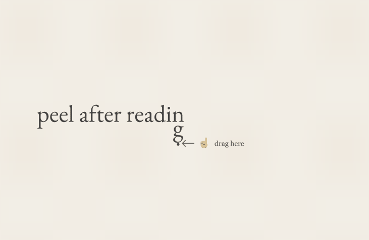
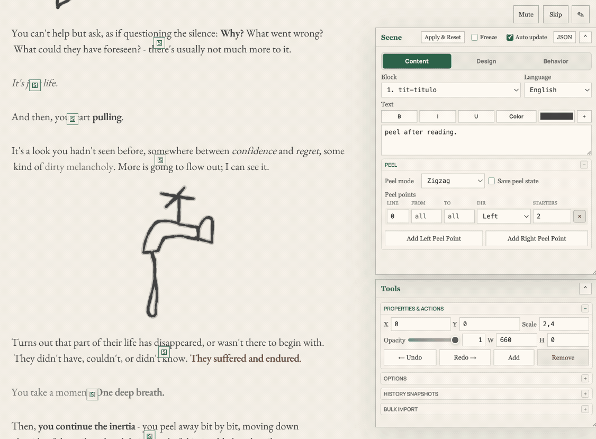
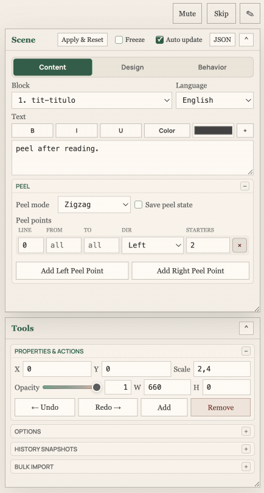
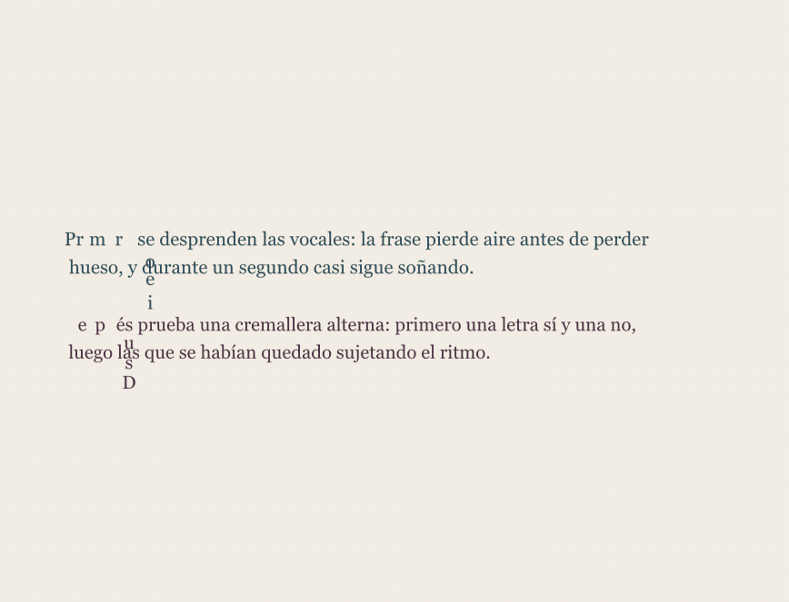
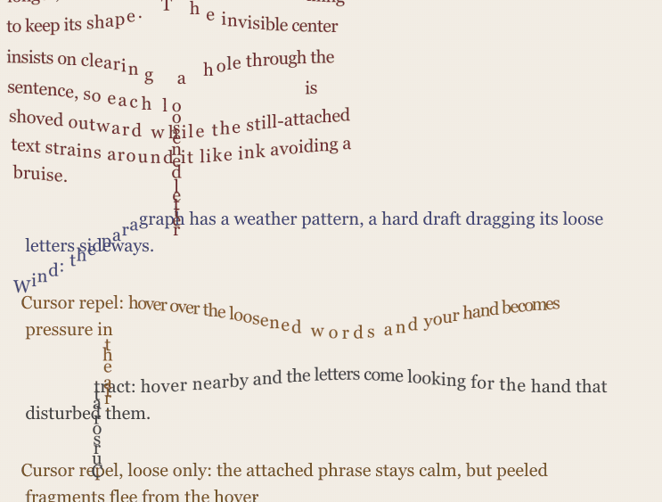
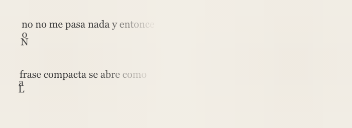
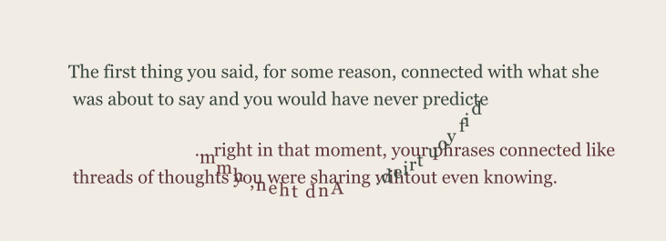

# PeelType

PeelType is a tiny framework for experimental interactive typography. It treats text like physical material: letters can be peeled, pulled, censored, shaken, tethered, attracted by force fields, constrained into shapes, and used as narrative triggers.

It began as the engine for **Pill After Reading**, an interactive personal story about peeling words away to advance through a poem. The editor is included, so you can make your own scenes and ship them as your own non-commercial interactive work with attribution.

<p align="center">
  <a href="https://clovelt.github.io/PeelType/tirita.html">
    
  </a>
</p>

<p align="center">
  <a href="https://clovelt.github.io/PeelType/tirita.html"><strong style="font-size: 28px;">PLAY THE DEMO</strong></a>
</p>

## What It Does

- Peel text letter by letter, by word structure, by syllable, by vowels/consonants, or through narrative-specific ordering.
- Write formatted text with BBCode-style tags for color, size, gradients, shake, float, links, no-peel sections, and more.
- Build scenes in the browser with a live editor.
- Add force fields, particles, sounds, ambient changes, timed buttons, branching flags, reveal/hide events, and physics objects.
- Import SVG line art and make its strokes peelable.
- Constrain paragraphs to shapes or draw custom paths for text.
- Save scene JSON and include it in the project as a standalone interactive work.



## Install

PeelType has no npm dependencies.

```bash
git clone https://github.com/clovelt/PeelType.git
cd PeelType
npm start
```

Open:

```text
http://localhost:4242/
```

To use another port:

```bash
PORT=8080 npm start
```

You can also serve it with any static server:

```bash
python3 -m http.server 8080
```

then open:

```text
http://localhost:8080/tirita.html
```

Opening `tirita.html` directly through `file://` is not recommended because browsers may block ES module imports.

## Local Preview

The included Node server is dependency-free and serves the static app from this folder.

```bash
npm start
```

It also enables a few editor authoring endpoints:

- `GET /api/illustrations` lists local illustration assets for the editor picker.
- `POST /api/illustrations` saves dropped image/SVG assets into `illustrations/`.
- `POST /api/save-poem` saves the built-in story JSON while editing locally.
- `POST /api/save-locale` saves locale files while editing locally.

Static hosting works for playback and for editing in browser storage, but saving files back into the project requires the local Node server.



## Using The Editor

Open the demo and use the editor panel to modify the active scene. The editor supports live changes to text, peel modes, colors, gradients, paths, force fields, events, particles, sounds, constraints, illustrations, and branching behavior.

Useful authoring controls:

- **Scene selector**: load the included examples and experiments.
- **Content**: edit text, BBCode tags, paragraph behavior, language/localized strings, and raw JSON.
- **Design**: change typography, gradients, layout, paths, shapes, and illustration rendering.
- **Behavior**: configure peel modes, physics, force fields, events, step progression, persistence, and conditional narrative.
- **Freeze**: pause physics while editing.
- **JSON**: inspect or export the current scene data.

The browser stores editor state in `localStorage`, so experiments can survive a refresh. Use the JSON export when you want a durable file you can commit.



## Ship Your Own Scene

The simplest workflow is:

1. Start the local server with `npm start`.
2. Open `http://localhost:4242/tirita.html`.
3. Create or modify a scene in the editor.
4. Export the scene JSON from the editor.
5. Save it as a new file in `js/`, for example `js/my-story.json`.
6. Register it in `js/poems.json` so the app can load it.
7. Add any SVG, PNG, JPG, or GIF assets under `illustrations/`.
8. Test locally, then deploy the folder.

You can use PeelType to publish your own non-commercial interactive story, poem, essay, typographic toy, or visual-novel experiment. Please keep attribution to the original framework and link back to this repository.



## Authoring Ideas

PeelType is especially good for narrative mechanics where the interaction is part of the sentence:

- Peel censorship away instead of peeling the text itself.
- Reveal intrusive thoughts one loose letter at a time.
- Change a sentence's meaning by removing selected words.
- Pull syllables, punctuation, first letters, or vowels before the rest.
- Use force fields as metaphors for attraction, repulsion, wind, pressure, or orbit.
- Attach illustrations to words and release them as physics objects.
- Create conditional paths with flags and timed choices.



## Hosting

PeelType is a static web app. For GitHub Pages, Netlify, Vercel, Cloudflare Pages, itch.io HTML uploads, or a normal FTP/SFTP host, publish these files and folders:

```text
tirita.html
favicon.svg
css/
docs/media/
fonts/
illustrations/
js/
```

The host must serve JavaScript modules with a JavaScript MIME type, usually `text/javascript` or `application/javascript`.

For GitHub Pages, the demo URL for this repository is:

```text
https://clovelt.github.io/PeelType/tirita.html
```

If a static host caches aggressively, bump the query string in `tirita.html`:

```html
<script type="module" src="./js/main.js?v=45"></script>
```



## Project Structure

```text
tirita.html              Main app entry point
server.js                Dependency-free local authoring server
css/style.css            Runtime and editor styles
fonts/                   Bundled local EB Garamond files
illustrations/           SVG and image assets used by scenes
js/main.js               App bootstrap and orchestration
js/editor.js             Runtime editor UI
js/peel-after-reading.json
js/poems.json            Story manifest
js/scenes.js             Example scenes and experiments
js/locales/              Localized story text
js/vendor/geometry.js    Local SVG geometry helpers
docs/media/              README GIFs
```

## License

This project is released under the **Creative Commons Attribution-NonCommercial 4.0 International License**.

You may share and adapt the work for non-commercial purposes as long as you give appropriate credit. Commercial use is not allowed without explicit permission.

See [LICENSE](LICENSE) for the full license text.

## Credits

Created by Jose Gustavo Chico.

The censorship-peeling and meaning-shift interaction ideas came from StaffWombat / Josh during development conversations. Please credit the framework if you fork it, remix it, or publish a piece made with it. I would love to see what people make.
